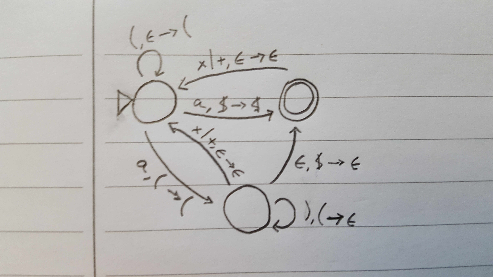

# FOCS Homework 10, for Day 11

You may edit your answers into this file, or add a separate file in the same directory.

If you add a separate file, please include the following at the top:

```
Student Name: Frankly Olin [change to your name]
Check one:
[ ] I completed this assignment without assistance or external resources.
[ ] I completed this assignment with assistance from ___
   and/or using these external resources: ___
```

## I. Logic

### 1.

The following tables are [truth tables](https://en.wikipedia.org/wiki/Truth_table).

_true_ and _false_ are represented by `T` and `F`. _OR(false, true)_ is commonly written in [infix notation](https://en.wikipedia.org/wiki/Infix_notation): `F OR T`.

The second table shows the value of the function _a OR b_, for all possible values _a_ and _b_. For example, _false OR true_ (the second row) has the value _true_ (the final cell of that row).

_a_ | _b_ | _a_ AND _b_
----|-----|---
 F  |  F  | F
 F  |  T  | F
 T  |  F  | F
 T  |  T  | T

_a_ | _b_ | _a_ OR _b_
----|-----|---
 F  |  F  | F
 F  |  T  | T
 T  |  F  | T
 T  |  T  | T

_a_ | _b_ | _a_ XOR _b_
----|-----|---
 F  |  F  | F
 F  |  T  | T
 T  |  F  | T
 T  |  T  | F

a. Construct the truth table for _a XOR (b XOR a)_.

_a_ | _b_ | _a_ XOR _b_ | _a_ XOR (_b_ XOR _a_)
----|-----|-------------|----------------------
 F  |  F  |      F      | F
 F  |  T  |      T      | T
 T  |  F  |      T      | T
 T  |  T  |      F      | T

b. Which function corresponds to the English word "or", as used in "You will eat your meat OR you can't have any pudding" (where _a_ = "You will eat your meat" and _b_ = "you can't have any pudding").

NOT?

## II. Questions 2–6 are the same as in-class activities 2-6

### 2.

Consider the following context-free grammar G:

```
E -> E + E | T         # <- added "| T"
T -> T x T | (E) | a
```

Convert G to a PDA.



### 3.

Convert grammar G from (2) to Chomsky Normal Form.

### 4.

```
T -> a
E -> a
P -> +
M -> x
O -> (
C -> )

E -> EE_1
T -> TT_1
T -> OT_2
E -> TT_1
E -> OT_2
E_1 -> PE
T_1 -> MT
T_2 -> EC
```

Is the grammar G's language a regular language? If yes, produce a FSA or regular expression for this language. If not, show this. 

No; intuitively, it can contain arbitrarily nested parentheses, which can't be processed by an automaton without a stack.

### 5.

Theorem 1: The language {a^n b^n c^n} is not a context-free language.

a. Use Theorem 1, together with the languages {a^i b^i c^j} and {a^i b^j c^j}, to show that the set of context-free languages is not closed under intersection.

b. Use the pumping lemma for context-free languages [Sipser pp. 125] to prove Theorem 1.

### 6.

Consider the context-free grammar G:

```
S -> NP VP
NP -> NP PP
NP -> DET N
VP -> V NP
VP -> VP PP
DET -> a | the
N -> boy | girl | flowers | binoculars
V -> touches | sees
PP -> P NP
P -> in | from | with
```

a. Show that the string "the girl touches the boy with the flower" has two
different leftmost derivations.

```
S -> NP VP -> DET N VP -> the N VP -> the girl VP -> the girl V NP -> the girl touches NP -> ... NP PP -> ... DET N PP -> ... the boy PP -> ... the boy P NP -> .... with NP -> .... with DET N -> the girl touches the boy with the flower

							 ..... -> the girl VP -> the girl VP PP -> the girl V NP PP -> the girl touches NP PP -> ... NP PP -> .....

```
b. Describe in English the two different meanings of this sentence.

The touching could be done with the flower, or the boy could have the flower.

c. Use G to generate another ambiguous sentence.

```
S -> NP VP -> DET N VP -> the boy VP -> the boy V NP -> the boy sees NP -> the boy sees the flowers with the binoculars
```

d. Modify G so that it generates strings with adjectives: `the girl saw the tall boy`, `the girl touches the boy with a purple flower`.

Add `DET -> AR AD`, replace `DET -> a | the` with `AR -> a | the`, make rules for `AD` to terminate at adjectives.

You don't need to know this, but here's how the variable names relate to linguistics.

Variable | meaning
---|---
S | sentence
DET | determiner (article)
N | noun
NP | noun phrase
P | preposition
PP | prepositional phrase
V | verb
VP | verb phrase

[Adapted from Sipser 2.8.]
